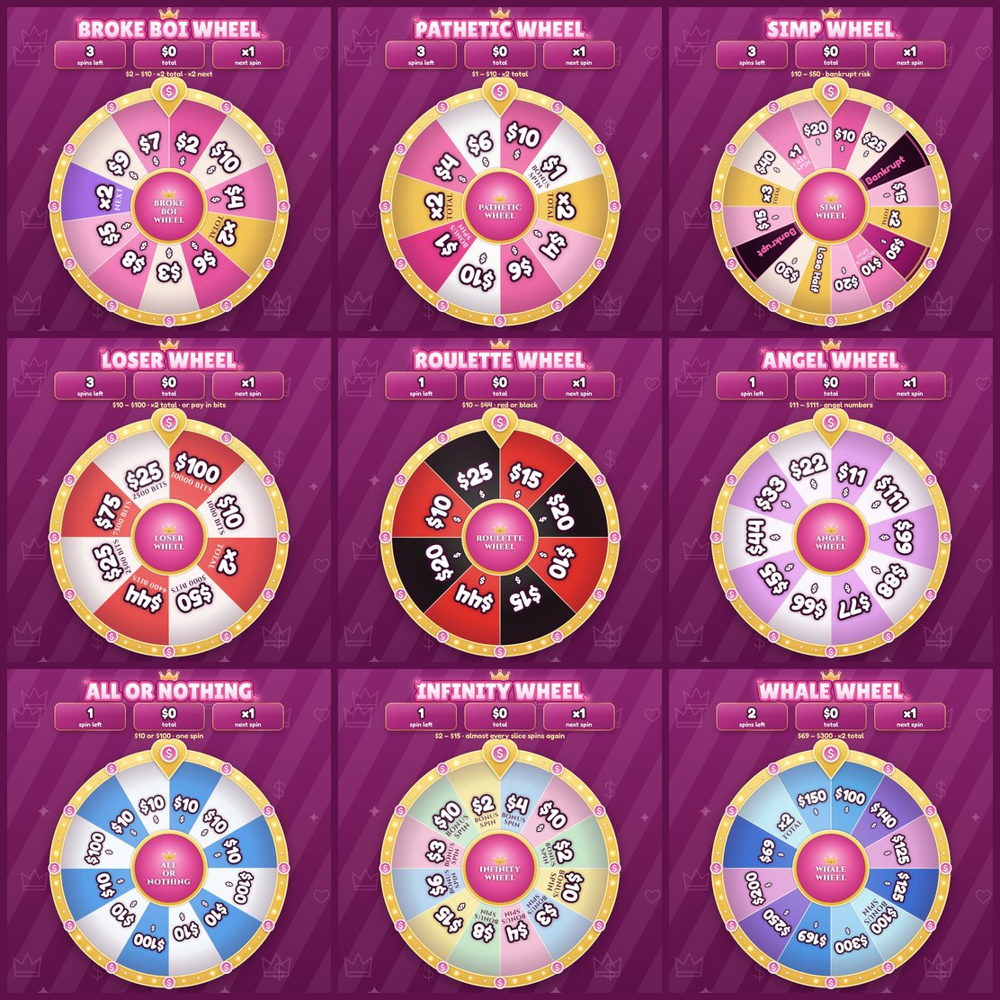
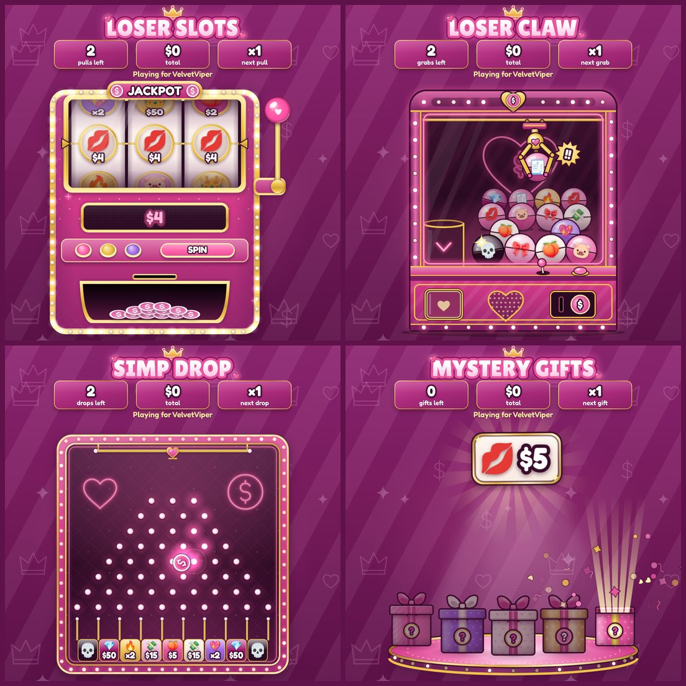

# FinWheel

A prize wheel and mini-games for OBS and Twitch: money wheels, a slot machine, a claw machine, a plinko board,
mystery gifts, prize wheels and chat raffles, rendered as a transparent browser-source overlay and driven from an
OBS dock. The server picks every result with a cryptographic RNG and tells each overlay where to land, so several
scenes always agree.

**[Documentation and live wheels: platob.github.io/finwheel](https://platob.github.io/finwheel/)**: play all 16
default wheels and games in your browser, then follow the full setup, Twitch and wheel-building guide.

<p align="center">
  
  
</p>

## Features

- **16 wheels ready to play.** Nine money wheels, four mini-games and three prize wheels, each with its own odds.
  The dock simulates every money wheel's payouts and bust rate.
- **Money wheels.** From the _Broke Boi Wheel_ ($2 – $10, about $17 a 3-spin game, never bankrupt) to the
  _Whale Wheel_ ($69 – $300, about $330 a 2-spin game). Choose how many spins a player gets. Slices add cash
  (`$5`), multiply the total (`×2 total`), double the next spin's cash (`×2 next`), grant bonus spins or go
  **Bankrupt**. A game that lasts 2+ spins ends on a total screen.
- **Mini-games.** Any wheel can be played as a slot machine, a claw machine, a plinko board or mystery gifts: same
  prizes and odds, another show. Four ship ready: _Loser Slots_, _Loser Claw_, _Simp Drop_ and _Mystery Gifts_.
- **Prize wheels.** _The Grand Wheel_ sends players on to a money wheel, one of the four games, the _Prize Vault_
  (real rewards, limited stock) or the _Dare Wheel_.
- **Chat commands.** `!spin` plays the active wheel, and each wheel or game can have its own command: `!brokeboi`,
  `!whale`, `!slots`, `!claw`, `!drop`, `!gift`, `!grand`, … Moderators choose the player and the count
  (`!slots @friend 5`).
- **Two looks.** _Glam_ (pink & gold, the default) or _Casino_ (emerald & gold), for the wheels and the games,
  picked in the dock or per browser source with `?theme=`.
- **Raffles.** Viewers type `!join`, entrants fill the wheel live, and the winner can go straight to a prize wheel.
- **Centre photos.** Upload photos from the dock; they fill the hub of the wheel, take turns, and appear in the
  slot machine, the claw machine and the plinko board too.
- **Twitch.** Channel-point rewards and bit cheers for any wheel or game, and optional chat announcements.
- **OBS.** Browser source, custom dock and a Python script for hotkeys.

## Quick start

You need [Node.js](https://nodejs.org) 22.13+, [git](https://git-scm.com) and OBS Studio 30+.

```bash
git clone https://github.com/Platob/finwheel.git
cd finwheel
npm install
npm run build
npm start
```

Keep the terminal open, then in OBS:

| Add                                             | URL                              | Notes                                                                    |
| ----------------------------------------------- | -------------------------------- | ------------------------------------------------------------------------ |
| Browser source (**Sources → + → Browser**)      | `http://localhost:4747/overlay/` | Width / Height `1080` / `1080`, tick **Control audio via OBS**           |
| Custom dock (**Docks → Custom Browser Docks…**) | `http://localhost:4747/dock/`    | Pick a wheel or game, type a player, press **Spin** (**Play** on a game) |

Next steps (Twitch chat, channel points, hotkeys, your own wheels): see the
[guide](https://platob.github.io/finwheel/setup/).

## Development

```bash
npm run dev        # server with reload on :4747 + Vite on :5173 (open http://localhost:5173/dock/)
npm run check      # typecheck, lint, format check, tests
```

The server (`src/server`) owns all state and decides every result; the overlay (`src/web/overlay`) only animates
what it is told, on the wheel or a game stage, and the dock (`src/web/dock`) sends commands. Project layout,
screenshots and the documentation site: [Development](https://platob.github.io/finwheel/development/).
