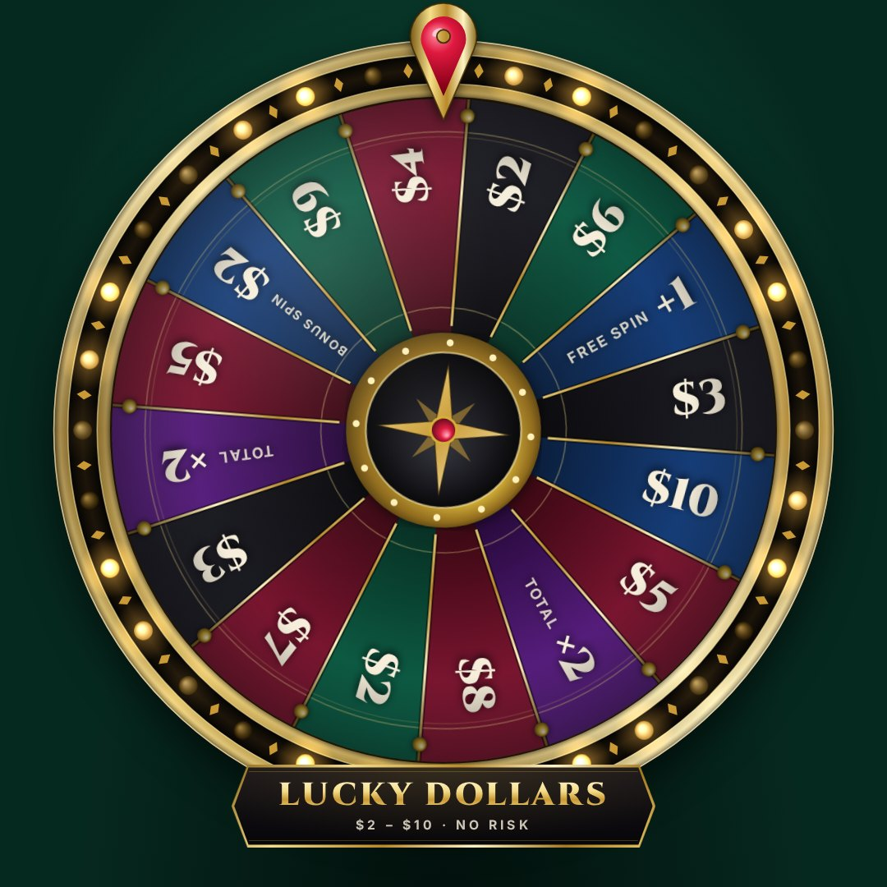
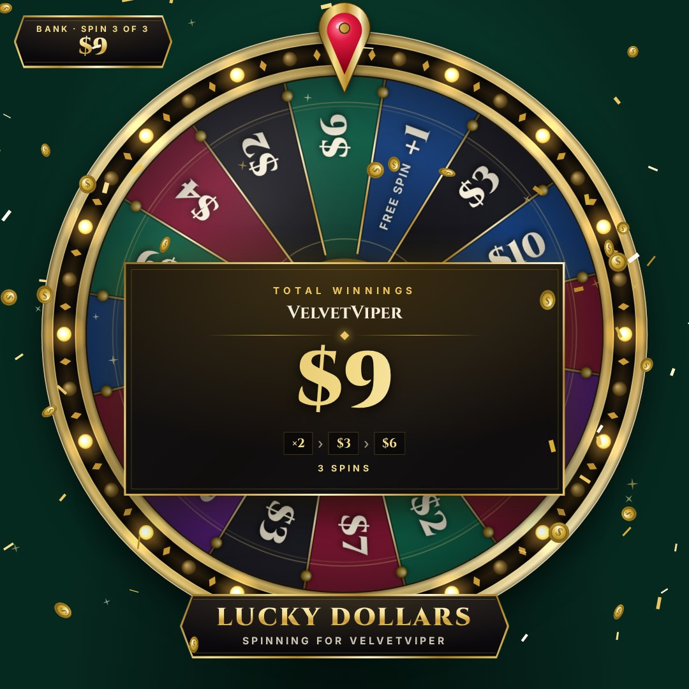
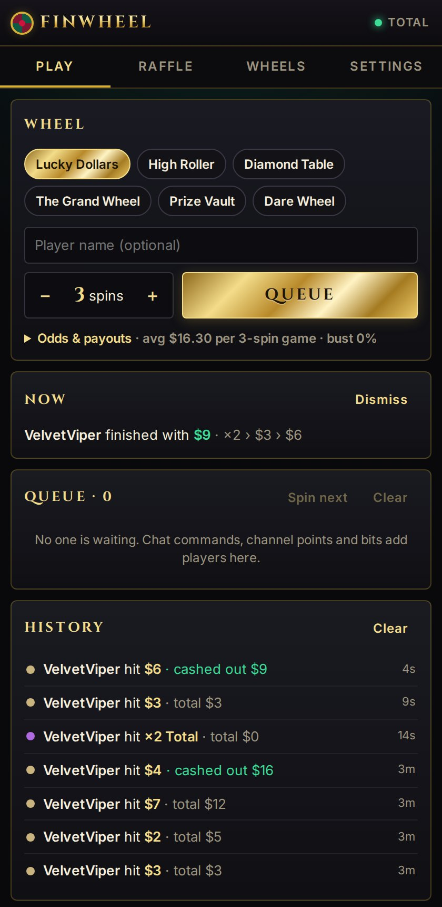
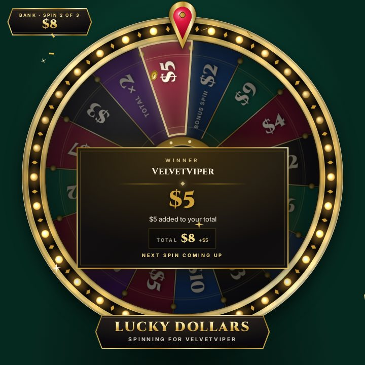
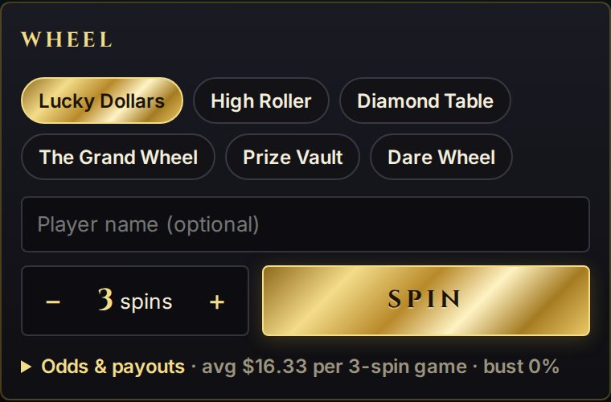
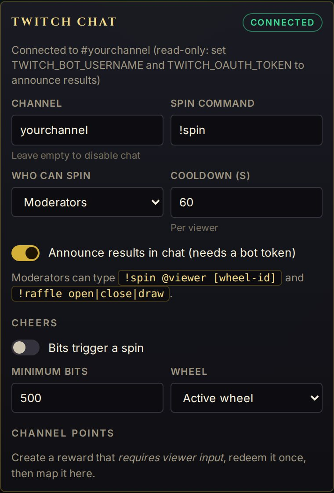

# FinWheel

A classy casino-style prize wheel for OBS and Twitch: money games, prize categories and chat raffles,
rendered as a transparent browser-source overlay and driven from an OBS dock.

<p align="center">
  
  
  
</p>

## Features

- **Money games.** Pick how many spins a player gets; every slice can add cash (`$5`), multiply the
  running total (`×2`), grant bonus spins or go **Bankrupt**. Once all spins have run, the overlay shows
  the **total winnings** with every spin listed.
- **Risk ladder out of the box.** _Lucky Dollars_ ($2 – $10, no risk), _High Roller_ ($10 – $50, bankrupt
  slices) and _Diamond Table_ ($50 – $500, high risk). The dock simulates each wheel so you know the
  average payout, the bust rate and the best case before going live.
- **Wheel categories.** A prize can chain into another wheel: _The Grand Wheel_ picks a category
  (money tables, _Prize Vault_, _Dare Wheel_) and the player keeps spinning there.
- **Raffles.** Viewers type `!join`, entrants fill the wheel live, subscribers can get extra tickets, and the
  winner can go straight to a prize wheel.
- **Casino look.** Gold rim with chasing marquee bulbs, ruby pointer that flicks on every peg, emerald /
  bordeaux / onyx slices, Cinzel typography, gold confetti and coin showers, synthesized sounds.
- **Fair and server-authoritative.** The server picks results with a cryptographic RNG and tells every
  overlay exactly where to land, so multiple scenes always agree. Prize stock is tracked automatically.
- **Twitch integration.** Chat commands, channel-point rewards, bit cheers, optional chat announcements.
- **OBS integration.** Browser source + custom dock, plus a Python script that adds OBS hotkeys.

## Setup: OBS + Twitch in 10 minutes

You need [Node.js](https://nodejs.org) 20.12+ (LTS), [git](https://git-scm.com) and OBS Studio 30+.

### 1. Start the server

```bash
git clone https://github.com/Platob/finwheel.git
cd finwheel
npm install
npm run build
npm start
```

Keep this terminal open while you stream. Check it from a second terminal:

```bash
curl http://localhost:4747/api/health
# {"ok":true,"name":"finwheel","version":"0.1.0"}
```

### 2. Add the wheel to a scene

In OBS: **Sources → + → Browser**, name it `FinWheel`, then set:

| Field                     | Value                            |
| ------------------------- | -------------------------------- |
| URL                       | `http://localhost:4747/overlay/` |
| Width / Height            | `1080` / `1080`                  |
| **Control audio via OBS** | ticked (wheel sounds go to OBS)  |

The background stays transparent. Run a 3-spin test game and watch it play in OBS:

```bash
curl -X POST http://localhost:4747/api/command -H 'Content-Type: application/json' \
  -d '{"type":"spin","player":"Tester","spins":3}'
```

```powershell
# Windows PowerShell
Invoke-RestMethod -Method Post http://localhost:4747/api/command -ContentType 'application/json' -Body '{"type":"spin","player":"Tester","spins":3}'
```

<p align="center"></p>

### 3. Add the control dock

In OBS: **Docks → Custom Browser Docks…**, Dock Name `FinWheel`, URL `http://localhost:4747/dock/`, **Apply**.
Drag the panel where you like. To play: pick a wheel, type the player, choose the spins, press **Spin**.

<p align="center"></p>

### 4. Connect Twitch chat

In the dock: **Settings → Twitch chat → Channel** = your channel name → **Save settings**. The badge turns
**connected** (reading chat needs no login). Try it in your chat:

```text
!spin                        you play the active wheel (broadcaster/mods)
!spin @friend 5 high-roller  friend plays 5 spins on High Roller
!raffle open                 viewers enter with !join
!raffle draw                 winner spins The Grand Wheel
```

To let viewers type `!spin` themselves, set **Who can spin** to _Everyone_ (or _Subscribers_) and keep a
cooldown.

<p align="center">
  
  
</p>

### 5. Announce results in chat (optional)

FinWheel needs a chat token for the account that posts (your channel or a bot account):

1. [dev.twitch.tv/console/apps](https://dev.twitch.tv/console/apps) → **Register Your Application**: OAuth
   Redirect URL `http://localhost`, Category _Chat Bot_, Client Type _Public_. Copy the **Client ID**.
2. Logged in as the posting account, open (replace `YOUR_CLIENT_ID`):
   `https://id.twitch.tv/oauth2/authorize?response_type=token&client_id=YOUR_CLIENT_ID&redirect_uri=http://localhost&scope=chat:read+chat:edit`
   → **Authorize**. The browser lands on a page that does not load, with
   `http://localhost/#access_token=abc123…` in the address bar: copy that token.
3. Put it in `.env` (`copy .env.example .env` on Windows) and restart `npm start`:

```bash
cp .env.example .env
```

```ini
TWITCH_BOT_USERNAME=yourbot
TWITCH_OAUTH_TOKEN=abc123yourtoken
```

Results, raffle openings and winners are now posted in chat. Tokens expire after a while: repeat step 2 when
announcements stop.

### 6. Channel points and bits (optional)

- **Channel points:** in the Twitch Creator Dashboard create a custom reward and tick **Require Viewer to Enter
  Text** (other rewards never reach chat). Redeem it once, then in the dock **Settings → Channel points**
  click **Map** next to it, pick a wheel, **Save settings**.
- **Bits:** **Settings → Cheers** → enable _Bits trigger a spin_, set the minimum and the wheel, **Save settings**.

### 7. OBS hotkeys (optional)

1. Install [Python 3](https://www.python.org/downloads/), then in OBS **Tools → Scripts → Python Settings**
   select its install folder.
2. **Scripts → +** → `obs/finwheel_hotkeys.py`.
3. **Settings → Hotkeys** → search `FinWheel` → bind _Spin_, _Spin next_, _Draw raffle winner_, …

### Troubleshooting

| Problem                       | Fix                                                                                                                                     |
| ----------------------------- | --------------------------------------------------------------------------------------------------------------------------------------- |
| Overlay is empty              | Is `npm start` running? `curl http://localhost:4747/api/health`, then right-click the source → **Refresh**.                             |
| No sound                      | Tick **Control audio via OBS** and unmute `FinWheel` in the Audio Mixer.                                                                |
| Chat commands ignored         | **Settings** badge must say _connected_. By default only the broadcaster and mods can `!spin`.                                          |
| Channel-point reward ignored  | The reward must **require viewer text**.                                                                                                |
| `Port 4747 is already in use` | FinWheel is already running, or pick another port: `PORT=4848 npm start` (PowerShell: `$env:PORT=4848; npm start`) and update the URLs. |

Overlay URL options: `?preview` adds a felt background to test in a normal browser, `?mute=1` silences one source.

## Playing

1. Pick a wheel in the dock's **Play** tab, type the player's name, choose the number of spins, press **Spin**.
2. Each spin shows its slice and the running **bank** (top-left badge on the overlay).
3. After the last spin (or a bankrupt), the **total winnings** screen appears.

Requests that arrive while a game is running wait in the **queue** and play automatically (or one by
one with _Spin next_ if auto-advance is off).

### Slice effects

| Field          | Meaning                                                                   |
| -------------- | ------------------------------------------------------------------------- |
| `cash`         | Added to the running total.                                               |
| `multiplier`   | Applied after adding `cash`: `2` doubles the total, `0.5` loses half.     |
| `extraSpins`   | Bonus spins on the same wheel.                                            |
| `bust`         | Bankrupt: the total drops to zero and the game ends.                      |
| `chainWheelId` | Continue on another wheel (its default spin count), keeping the total.    |
| `weight`       | Relative odds. With `sizing: "weight"` the slice size matches the odds.   |
| `stock`        | Remaining quantity (`null` = unlimited). Sold-out prizes leave the wheel. |
| `tier`         | `common`, `rare`, `epic`, `legendary`, `jackpot`: colour and celebration. |

Money slices print their amount on the wheel automatically (`$10`, `×2 TOTAL`, `+1 FREE SPIN`), computed
from these fields so the display always matches the payout.

## Chat commands

| Chat                            | Who                    | Effect                                                        |
| ------------------------------- | ---------------------- | ------------------------------------------------------------- |
| `!join`                         | everyone, raffle open  | Enter the raffle (keyword is configurable)                    |
| `!spin`                         | configurable, cooldown | Queue a game for yourself on the active wheel                 |
| `!spin @viewer 5 high-roller`   | moderators             | Queue a game for someone: spins and wheel optional, any order |
| `!raffle open \| close \| draw` | moderators             | Run the raffle from chat                                      |
| Channel-point reward            | everyone               | Mapped reward → game on a chosen wheel                        |
| Cheer ≥ minimum bits            | everyone               | Game on a chosen wheel                                        |

## HTTP API

Everything the dock does is available at `POST /api/command` with a JSON body, handy for Stream Deck
or scripts:

```bash
curl -X POST http://localhost:4747/api/command \
  -H 'Content-Type: application/json' \
  -d '{"type":"spin","player":"VelvetViper","spins":3,"wheelId":"lucky-dollars"}'
```

Commands: `spin`, `spinNext`, `queue.add`, `queue.remove`, `queue.clear`, `wheel.select`,
`raffle.open`, `raffle.close`, `raffle.draw`, `raffle.add`, `raffle.remove`, `raffle.clear`,
`overlay.show`, `overlay.hide`, `overlay.toggle`, `result.dismiss`, `history.clear`, `config.save`
(see [`src/shared/schema.ts`](src/shared/schema.ts)). `GET /api/state` returns the full state and
`GET /api/health` a liveness check.

## Configuration

- On first start, [`config/default.config.json`](config/default.config.json) is copied to
  `data/config.json`. Edit wheels in the dock (**Wheels** tab) or in that file while the server is stopped.
- Queue, raffle entrants and history survive restarts in `data/session.json`.
- Environment variables (see [`.env.example`](.env.example)): `PORT`, `HOST`, `FINWHEEL_DATA_DIR`,
  `FINWHEEL_TOKEN`, `FINWHEEL_ALLOWED_ORIGINS`, `TWITCH_BOT_USERNAME`, `TWITCH_OAUTH_TOKEN`.

### Security

The server listens on `127.0.0.1` only. It rejects requests whose `Host` is not local (DNS rebinding) and
cross-site `Origin`s, so a web page you visit cannot spin your wheel. If you expose it on the network
(`HOST=0.0.0.0`, e.g. a second streaming PC), set `FINWHEEL_TOKEN` and open the dock with
`/dock/?token=…`; the overlay keeps working without the token (read-only).

## Development

```bash
npm run dev        # server with reload on :4747 + Vite on :5173 (open http://localhost:5173/dock/)
npm run check      # typecheck, lint, format check, tests
npm test
```

```
src/
  shared/   config schema, protocol types, wheel geometry, game rules + simulator
  server/   HTTP + WebSocket server, wheel engine, persistence, Twitch chat bot
  web/
    overlay/  canvas wheel, effects, sounds (OBS browser source)
    dock/     Preact control panel (OBS custom dock)
obs/        OBS Python script for hotkeys
config/     default wheels
```

The server owns all state and decides every result; the overlay only animates what it is told,
which keeps several overlays (or a reloaded one) in sync mid-spin.
