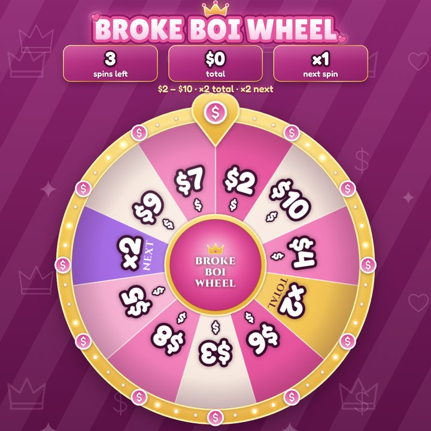
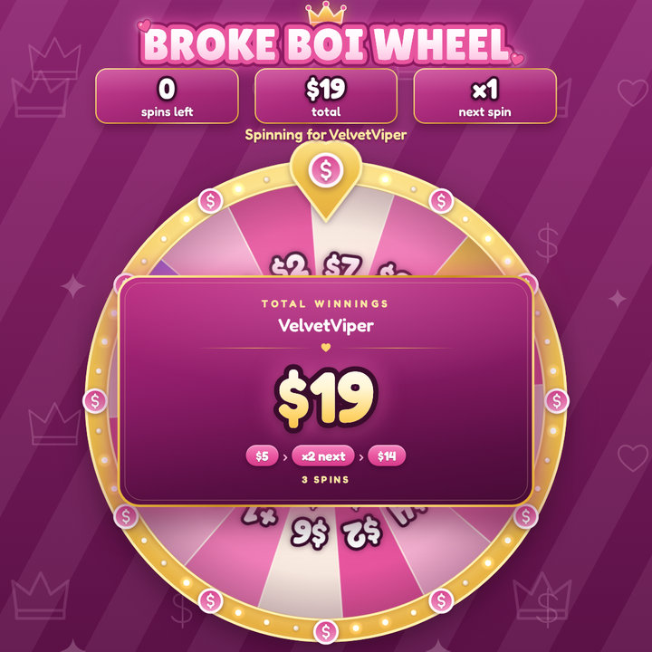

# FinWheel

A prize wheel for OBS and Twitch: money games, prize categories and chat raffles, rendered as a
transparent browser-source overlay and driven from an OBS dock.

{ width="320" }
{ width="320" }
{ width="156" }

## Features

- **Money games.** Pick how many spins a player gets; every slice can add cash (`$5`), multiply the
  running total (`×2`), grant bonus spins or go **Bankrupt**. Once all spins have run, the overlay shows
  the **total winnings** with every spin listed.
- **Risk ladder out of the box.** _Broke Boi Wheel_ ($2 – $10, no risk), _Simp Wheel_ ($10 – $50, bankrupt
  slices) and _Whale Wheel_ ($50 – $500, high risk). The dock simulates each wheel so you know the
  average payout, the bust rate and the best case before going live.
- **Wheel categories.** A prize can chain into another wheel: _The Grand Wheel_ picks a category
  (money tables, _Prize Vault_, _Dare Wheel_) and the player keeps spinning there.
- **Raffles.** Viewers type `!join`, entrants fill the wheel live, subscribers can get extra tickets, and the
  winner can go straight to a prize wheel.
- **Casino look.** Gold rim with chasing marquee bulbs, ruby pointer that flicks on every peg, emerald /
  bordeaux / onyx slices, Cinzel typography, gold confetti and coin showers, synthesized sounds.
- **Fair and server-authoritative.** The server picks results with a cryptographic RNG and tells every
  overlay exactly where to land, so multiple scenes always agree. Prize stock is tracked automatically.
- **Twitch integration.** Chat commands, channel-point rewards, bit cheers, optional chat announcements.
- **OBS integration.** Browser source + custom dock, plus a Python script that adds OBS hotkeys.

## Get started

1. [Setup](setup.md): start the server, add the overlay and the dock to OBS.
2. [Twitch](twitch.md): chat commands, announcements, channel points and bits.
3. [Playing](playing.md): games, the bank, the queue and raffles.
4. [Wheels & prizes](wheels.md): build your own wheels.
