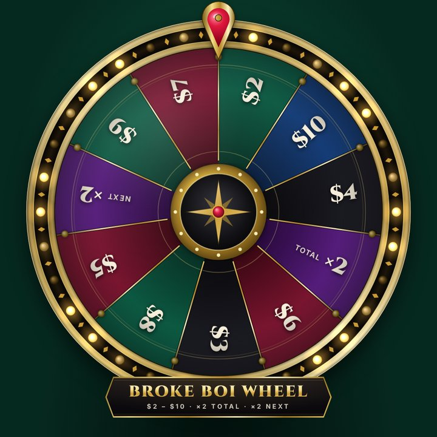
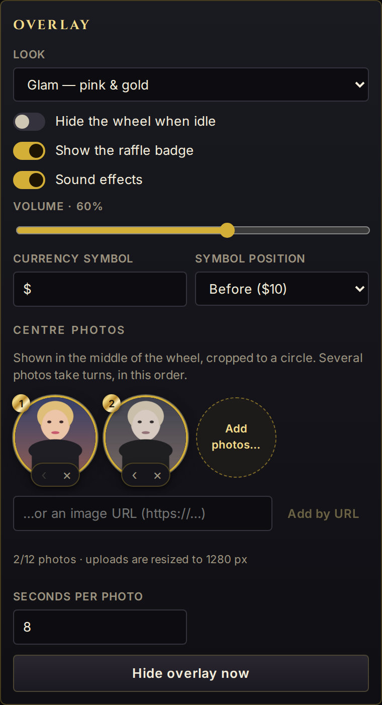

# Looks & photos

The overlay has two looks. The dock picks the look of every overlay; a URL option can force one on a single
browser source. Both play the same games, sounds and results.

## Glam

The default look: pink, cream and gold slices with white sticker lettering, a gold rim set with pink `$` coins and
pearl lights, and a gold heart pointer. Above the wheel: a crown, the wheel name in a bubble title, the
[stat row](playing.md#stat-row-and-bank-badge) (**spins left**, **total**, **next spin**) and a status line. The
hub shows the wheel name under a small crown. Wins throw pink confetti, hearts and `$` coins.

## Casino

Gold rim with chasing marquee bulbs, emerald / bordeaux / onyx slices, Cinzel lettering, a compass-star hub and a
ruby pointer. The wheel name and status sit on a plaque under the wheel; money games show the **Bank** badge top
left. Wins throw gold confetti, coins and sparkles.

{ width="340" }

{ width="340" }

|                | Glam                                                        | Casino                                    |
| -------------- | ----------------------------------------------------------- | ----------------------------------------- |
| Wheel name     | Bubble title above the wheel, and in the hub                | Plaque under the wheel                    |
| Money game     | Stat row: spins left, total, next spin                      | `Bank · Spin 2 of 3` badge, top left      |
| Raffle badge   | Bottom right                                                | Top right                                 |
| Slice colours  | Pink cycle; gold `×N total`, lavender `×N next` ([more](wheels.md#how-money-slices-look)) | Emerald, bordeaux, onyx; coloured by tier |

## Switch the look

- **Every overlay:** in the dock, **Settings → Overlay → Look**: _Glam — pink & gold_ or _Casino — emerald &
  gold_, then **Save settings**. Open overlays switch at once.
- **One browser source:** add `?theme=casino` (or `?theme=glam`) to its URL, e.g.
  `http://localhost:4747/overlay/?theme=casino`. That source keeps this look whatever the dock says.
  **Settings → OBS links** has this link ready for the look you are not using (_Overlay, always the Casino look_),
  with a **Copy** button.

The [live wheels](index.md) on the home page have **Glam** / **Casino** buttons to compare them.

## Centre photos

Photos fill the hub of the wheel, cropped to a circle (portraits keep their upper part, where faces usually are),
and stay upright while the wheel turns. Glam writes the wheel name over the photo; casino shows the photo instead
of its compass star. With several photos, they take turns in list order and cross-fade every **Seconds per
photo**.

### Upload from the dock

1. In the dock: **Settings → Overlay → Centre photos → Add photos…**, pick one or more images.
2. The dock resizes each one (longest side 1280 px, JPEG, or PNG when it has transparency) and uploads it:
   _Uploading 1/2…_.
3. When it says _2 photos uploaded: press Save settings_, press **Save settings**. Stay on **Settings** until
   then: leaving the tab drops unsaved changes.

The thumbnails are numbered in display order: **‹** shows a photo earlier, **×** removes it. With two or more
photos, **Seconds per photo** appears. A thumbnail reading _No preview_ does not load (see
[Troubleshooting](troubleshooting.md#photos)).

{ width="380" }

### Photo URLs

Paste a link in _…or an image URL (https://…)_ and press **Add by URL** (or Enter), then **Save settings**. A URL
is an `http://` or `https://` address, or a path on the FinWheel server such as `/media/…`. The overlay loads
it directly, so it must open the image itself, not a page around it.

### Limits

| What                  | Limit                                                                                     |
| --------------------- | ----------------------------------------------------------------------------------------- |
| Photos                | 12                                                                                        |
| Seconds per photo     | 2 to 120 (default 8)                                                                      |
| Uploaded file         | 8 MB; JPEG, PNG, WebP or GIF, checked against the file content (SVG is refused)           |
| Photo URL             | 500 characters                                                                            |
| Loading               | A photo that fails, or is not loaded after 10 seconds, is skipped                         |

Photos are still images: a GIF shows a single frame.

### Where uploads are stored

In `data/media/` (inside `FINWHEEL_DATA_DIR` when set), served at `http://localhost:4747/media/<file>`. Files are
named after a hash of their content, so the same picture uploaded twice is one file (the dock then says _already in
the list_). Removing a photo from the list keeps its file: delete it from `data/media/` if you no longer need it.
The [HTTP API](api.md#upload-a-photo) can upload photos too.

## Preview and backdrop

The overlay is transparent for OBS. Two URL options paint the look's backdrop behind it: magenta stripes with
faint crowns, hearts and `$` signs for glam, green felt for casino.

| URL                  | Use                                                                    |
| -------------------- | ---------------------------------------------------------------------- |
| `/overlay/`          | OBS browser source, transparent background.                            |
| `/overlay/?preview`  | Check the overlay in a normal browser.                                 |
| `/overlay/?backdrop` | The same backdrop in OBS, for a scene with nothing behind the wheel.   |

Options combine: `http://localhost:4747/overlay/?theme=casino&backdrop`. All overlay URL options are listed in the
[HTTP API](api.md#overlay-url-options) page.
