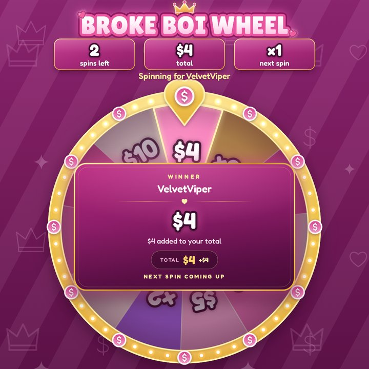
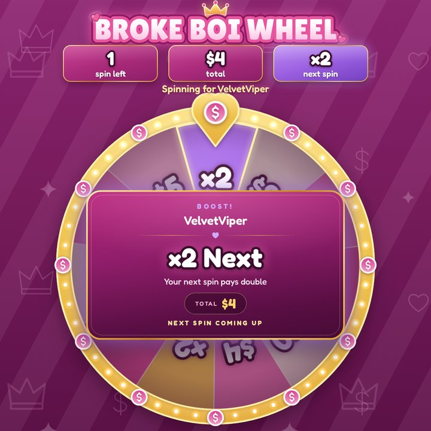

# Playing

## Start a game

In the dock's **Play** tab: pick a chip (one per wheel, with its game's icon), type a player (optional), set the
number of plays with **−** / **+** (spins on a wheel; pulls, grabs, drops or gifts on a [mini-game](#games); the
wheel's default to start with, 20 at most), press **Spin** (**Play** on a mini-game). While a game runs the button
reads **Queue**: the request waits in the **Queue** and plays automatically when the game ends (or one by one with
**Spin next** if **Settings → Spin → Play the queue automatically** is off). Chat (`!spin`, or a wheel's own
command such as `!brokeboi` or `!slots`: see [Chat commands](twitch.md#chat-commands)), channel points, bits and
the [HTTP API](api.md) start games the same way.

**Now** follows the game (`Bank $5 spin 2 of 3 · ×2 next`, or `pull 2 of 3` on Loser Slots); **Dismiss** closes a
result or total screen early. **Odds & payouts** under the button simulates the selected wheel with the chosen
count: average, median and best payout, how often it pays nothing, and the chance of every slice.

{ width="300" }

## Stat row and bank badge

A money game (any wheel or game with cash, `×N` or bankrupt slices) keeps a running total, shown differently by
each [look](looks.md):

| Look   | Where                                                                                                                  |
| ------ | ---------------------------------------------------------------------------------------------------------------------- |
| Glam   | **Stat row** above the wheel: **spins left**, **total**, **next spin** (`×1`; `×2` in lavender once a boost is armed). |
| Casino | **Bank** badge, top left: `Bank · Spin 2 of 3` and the running total.                                                  |

On a mini-game the words follow it: **pulls left** and **next pull** on Loser Slots, `Bank · Grab 2 of 3` on
Loser Claw (see [Games](#games)). Bonus spins and chained wheels raise the count as they are won. When the glam
overlay is idle on a money wheel, the stat row previews the next game: the wheel's default count, `$0`, `×1`. The
status line under it shows the wheel's subtitle, or _Spinning for_ the player during a game (_Playing for_ on a
mini-game; casino puts both on the plaque under the wheel).

## Games { #games }

Four of the default wheels are played as mini-games instead of a wheel. Tap one to play it, or follow **Slices &
odds** to its prizes:

| Game                                     | Plays as      | Chat     | Per game | Pays (average) | Bankrupt   |
| ---------------------------------------- | ------------- | -------- | -------- | -------------- | ---------- |
| [Loser Slots](wheels.md#loser-slots)     | Slot machine  | `!slots` | 3 pulls  | about $22      | never      |
| [Loser Claw](wheels.md#loser-claw)       | Claw machine  | `!claw`  | 3 grabs  | about $25      | about 10 % |
| [Simp Drop](wheels.md#simp-drop)         | Plinko        | `!drop`  | 3 drops  | about $34      | 18 %       |
| [Mystery Gifts](wheels.md#mystery-gifts) | Mystery gifts | `!gift`  | 1 gift   | about $13      | never      |

Each game is a wheel underneath: its prizes are slices, with the same weights, stock and effects (cash, `×N total`,
[`×N next`](#next-rule), free plays, bankrupt, chains to another wheel) and a default number of plays per game. The
server draws the prize exactly as for a wheel spin; the game only animates its way to it, so every overlay shows
the same play. The stat row, bank badge, result cards, total screen and chat announcements work as on a wheel. A
wheel can send a player on to a game in the same turn and bank: _Loser Slots_ on The Grand Wheel gives 3 pulls on
the slot machine. To turn any wheel into a game, change its **Game** in the dock's **Wheels** tab
([Wheels & prizes](wheels.md)).

How each game shows the prize:

- **Loser Slots**, a slot machine: a pull drops the lever, and the three reels stop left to right on the prize,
  three of a kind on the payline. In about 4 plays out of 10 the last reel stops one symbol short, then crawls in.
  Each symbol shows the prize's icon and amount; the cabinet's display reads the prize (`$8 BONUS SPIN`).
- **Loser Claw**, a claw machine: a pile of capsules, at least one per prize, more for the likelier ones (unless
  **Capsules** is _Same for every prize_). The claw roams with a few fake-outs, drops on a capsule of the prize,
  lifts it (it slips, but holds), drops it in the chute, and the capsule opens in front of the glass. The claw
  never misses.
- **Simp Drop**, a plinko board: a coin falls from a heart carriage and bounces down the pegs into the prize's bin.
  There is one bin per prize, in slice order from left to right, all the same width whatever the odds. The edge
  bins are _Bankrupt_, _$50_ sits next to them and _$5_, the likeliest, in the middle.
- **Mystery Gifts**: a row of wrapped boxes, one per prize but never fewer than 3 or more than 5 (5 here, for 7
  prizes). The boxes hop and shuffle like a shell game, one opens and its prize rises out, then the others open to
  show other prizes that were missed. Nobody chooses the box: the
  server drew the prize by weight, and the missed prizes are only for show.

A play lasts a share of **Settings → Spin → Duration (s)**: with the default 8 s, a wheel spin or a grab takes
8 s, a pull 5.6 s, a drop 6.8 s (10 s at most, whatever the duration) and a gift 7.2 s, give or take 8 %.

The overlay names the plays after the **Game** of the wheel on screen:

| **Game** | Stat row (glam)               | Bank badge (casino)  | Result card                           |
| -------- | ----------------------------- | -------------------- | ------------------------------------- |
| Wheel    | **spins left**, **next spin** | `Bank · Spin 2 of 3` | `+1 free spin`, `Next spin coming up` |
| Slots    | **pulls left**, **next pull** | `Bank · Pull 2 of 3` | `+1 free pull`, `Next pull coming up` |
| Claw     | **grabs left**, **next grab** | `Bank · Grab 2 of 3` | `+1 free grab`, `Next grab coming up` |
| Plinko   | **drops left**, **next drop** | `Bank · Drop 2 of 3` | `+1 free drop`, `Next drop coming up` |
| Gifts    | **gifts left**, **next gift** | `Bank · Gift 2 of 3` | `+1 free gift`, `Next gift coming up` |

The dock says **Play** instead of **Spin** and `Playing Loser Slots for Ana…` in **Now**. The cabinets take the
look's colours (pink and gold in glam, bordeaux and gold in casino) and each prize keeps the colour of its slice.
Centre photos also appear in the slot reels, on the claw machine's back wall and in the plinko board's top corners,
never in the gifts ([Looks & photos](looks.md)). The chat commands are listed on the
[Twitch](twitch.md#chat-commands) page.

## The ×N next rule { #next-rule }

A slice with **× Next spin** (`nextMultiplier`) set, like the _×2 Next_ slice of the Broke Boi Wheel, multiplies
the cash of the player's **next** spin (or pull, grab, drop, gift):

- **Stacks:** two _×2 Next_ in a row make `×4`; _×2_ then _×3_ make `×6`.
- **Used up by the next spin, whatever it lands on.** A _Free Spin_ or a _×2 Total_ (no cash) uses the boost
  without paying more. Boosted cash is added before a `×N total` on the same slice: the total becomes
  `(total + cash × boost) × multiplier`.
- **Cleared by bankrupt**, together with the total.
- **Lost when the game ends.** A _×2 Next_ on the last spin has nothing left to boost: its card says
  _No spins left for the boost_ (_No pulls left for the boost_ on Loser Slots).

A slice with both cash and `×N next` pays its own cash as printed and multiplies the boost for the spin after it.
Mystery Gifts plays 1 gift a game, so its _×2 Next + Gift_ also adds the gift it boosts.

Worked example, a 3-spin game on the Broke Boi Wheel:

| Spin | Lands on  | Pays  | Total | Stat row **next spin** |
| ---- | --------- | ----- | ----- | ---------------------- |
| 1    | `$5`      | `$5`  | `$5`  | `×1`                   |
| 2    | `×2 Next` | -     | `$5`  | `×2`                   |
| 3    | `$7`      | `$14` | `$19` | game over              |

Spin 2 shows the **Boost!** card. Spin 3's card reads **Cash out**, **Final total** `$19` `+$14 · ×2 boost`, and the
total screen lists `$5`, `×2 next`, `$14`.

## Result cards

Every spin or play ends on a card with the slice, its description and, in money games, the bank line: **Total** (or
**Final total** on the last spin, **Lost** on bankrupt) and what changed (`+$14 · ×2 boost`, `×2`). Under it,
what comes next: `+1 free spin`, `Next: Loser Slots`, `Next spin coming up`. On a mini-game the words follow it
(`+1 free pull`, `Next grab coming up`); the headings are the same.

| Heading                  | When                                                                                                         |
| ------------------------ | ------------------------------------------------------------------------------------------------------------ |
| **Winner**               | A slice for a named player.                                                                                  |
| **The wheel has spoken** | A slice with no player name (games too).                                                                     |
| **Boost!**               | A `×N next` slice armed a boost (the card says _Your next spin pays ×2_ unless the slice has a description). |
| **Cash out**             | The last spin of a money game.                                                                               |
| **Bankrupt**             | A bankrupt slice. With nothing in the bank: _Lucky break — nothing in the bank to lose_.                     |
| **Raffle winner**        | A raffle draw.                                                                                               |

A `×N total` slice on an empty bank says _Nothing in the bank to multiply yet_.

{ width="320" }

{ width="320" }

## Total screen

A money game that ends after 2 or more spins or plays (last one played, or bankrupt) shows its last card for
**Between turn spins (s)**, then the total screen for **Result shown (s)** (both in **Settings → Spin**):

- the heading: **Total winnings**, **Bankrupt**, or **Game over** when it paid nothing;
- the player and the total, counting up;
- one chip per spin or play (boosted cash shows what it paid: `$14` for a `$7` slice at `×2`) and their count
  (`3 spins`).

A game that ends on its first spin (a 1-spin game, or bankrupt on spin 1) ends on its result card. The dock's
**Now** shows `VelvetViper finished with $19 · $5 › ×2 next › $14`.

{ width="360" }

## Raffles

In the dock's **Raffle** tab press **Open entries**; viewers type `!join` in chat (or add names with **Add**).
While entries are open and someone has entered, the overlay shows the raffle wheel, one slice per entrant
(subscribers get **Settings → Raffle → Subscriber tickets**, so bigger slices), and the `!join` badge. **Draw
winner** spins it; the winner then spins the wheel set in **Winner then spins** (The Grand Wheel by default), which
sends them on to a money wheel, a mini-game, the Prize Vault or the Dare Wheel. Chat commands for mods are on the
[Twitch](twitch.md#chat-commands) page.

What each slice does is described in [Wheels & prizes](wheels.md).
