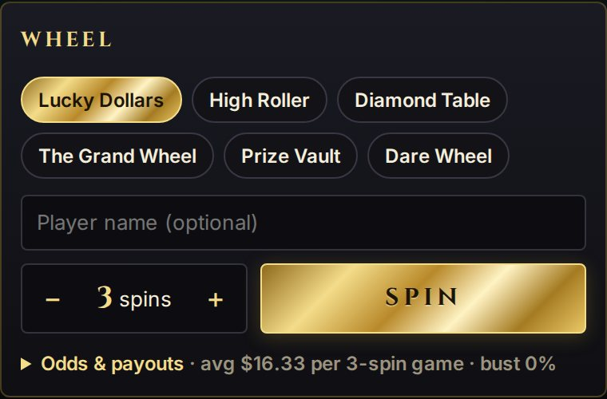

# Setup

You need [Node.js](https://nodejs.org) 22.13+ (24 LTS recommended), [git](https://git-scm.com) and OBS Studio
30+ (on Linux use the official Flatpak or PPA: some distro packages lack the Browser source).

## 1. Start the server

```bash
git clone https://github.com/Platob/finwheel.git
cd finwheel
npm install
npm run build
npm start
```

Keep this terminal open while you stream. Check it from a second terminal (`curl.exe` in Windows PowerShell):

```bash
curl http://localhost:4747/api/health
# {"ok":true,"name":"finwheel","version":"0.1.0"}
```

## 2. Add the wheel to a scene

In OBS: **Sources → + → Browser**, name it `FinWheel`, then set:

| Field                     | Value                            |
| ------------------------- | -------------------------------- |
| URL                       | `http://localhost:4747/overlay/` |
| Width / Height            | `1080` / `1080`                  |
| **Control audio via OBS** | ticked (wheel sounds go to OBS)  |

The background stays transparent. Run a 3-spin test game and watch it play in OBS:

```bash
curl -X POST http://localhost:4747/api/command -H 'Content-Type: application/json' \
  -d '{"type":"spin","player":"VelvetViper","spins":3}'
```

```powershell
# Windows PowerShell
Invoke-RestMethod -Method Post http://localhost:4747/api/command -ContentType 'application/json' -Body '{"type":"spin","player":"VelvetViper","spins":3}'
```

<p align="center"></p>

## 3. Add the control dock

In OBS: **Docks → Custom Browser Docks…**, Dock Name `FinWheel`, URL `http://localhost:4747/dock/`, **Apply**.
It opens floating: drag it into place. To play: pick a wheel, type a player, set the spins, press **Spin**.

<p align="center"></p>

## 4. OBS hotkeys (optional)

1. Windows/macOS: install [Python 3.12](https://www.python.org/downloads/release/python-31210/) (64-bit; OBS
   30–32 cannot load 3.13+). In OBS **Tools → Scripts → Python Settings**, pick the folder that holds
   `python312.dll` (usually `%LOCALAPPDATA%\Programs\Python\Python312`) or `/Library/Frameworks` on macOS.
   Linux: skip, OBS uses the system Python.
2. **Tools → Scripts → +** → `obs/finwheel_hotkeys.py`. Changed `PORT` or set `FINWHEEL_TOKEN`? Fill in the
   script's **Server URL** / **Control token**.
3. **Settings → Hotkeys** → type `FinWheel` in **Filter** → bind _FinWheel: Spin the active wheel_, _Spin next in
   queue_, _Draw raffle winner_, … (macOS: allow OBS in **Privacy & Security → Input Monitoring** so hotkeys work
   while a game has focus).

Next: [connect Twitch](twitch.md).
