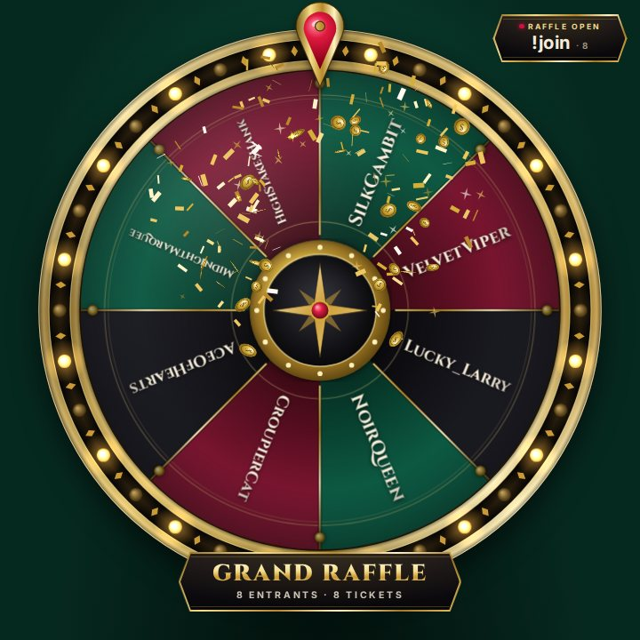

# Twitch

## Connect Twitch chat

In the dock: **Settings → Twitch chat → Channel** = your channel name → **Save settings**. The badge turns
**connected** (reading chat needs no login). Try it in your chat:

| Type in chat           | What happens                                                       |
| ---------------------- | ------------------------------------------------------------------ |
| `!spin`                | You play the active wheel                                          |
| `!spin @friend 5 simp` | Mods: friend plays 5 spins on Simp Wheel (any order, all optional) |
| `!raffle open`         | Mods: open the raffle (`!raffle close` stops entries)              |
| `!join`                | Anyone: enter the raffle (subscribers get 2 tickets)               |
| `!raffle draw`         | Mods: draw a winner, who then spins The Grand Wheel                |

Wheel ids (shown in the dock's **Wheels** tab): `broke-boi`, `simp`, `whale`, `grand`,
`prize-vault`, `dares`. To let viewers type `!spin`, set **Who can spin** to _Everyone_ or _Subscribers_.

<p align="center">
  
  
</p>

## Announce results in chat (optional)

FinWheel posts with the account that owns the token (your channel or a bot account):

1. Turn on 2FA (Twitch **Settings → Security and Privacy**), then
   [dev.twitch.tv/console/apps](https://dev.twitch.tv/console/apps) → **Register Your Application**: any unique
   name, OAuth Redirect URL `http://localhost` → **Add**, Category _Chat Bot_, Client Type _Confidential_ →
   **Create**. Click **Manage** and copy the **Client ID**.
2. Logged in as the posting account, open this URL with your Client ID, then **Authorize**:

   ```text
   https://id.twitch.tv/oauth2/authorize?response_type=token&client_id=YOUR_CLIENT_ID&redirect_uri=http://localhost&scope=chat:read+chat:edit
   ```

   The page fails to load; its address bar shows `http://localhost/#access_token=abc123…&scope=…`. Copy only
   the part between `access_token=` and `&`.

3. In the `finwheel` folder, copy the example settings, then remove the `# ` in front of the two `TWITCH_`
   lines and fill them in:

   ```bash
   cp .env.example .env
   ```

   ```ini
   TWITCH_BOT_USERNAME=yourbot
   TWITCH_OAUTH_TOKEN=abc123yourtoken
   ```

   `TWITCH_BOT_USERNAME` is the login of the account you authorized. Restart `npm start`; the Twitch chat card
   no longer says _read-only_. Bot account? Type `/mod yourbot` in your chat so slow or followers-only mode can't
   block it.

The token lasts about 60 days. Check it with
`curl -H "Authorization: OAuth abc123yourtoken" https://id.twitch.tv/oauth2/validate`; when the badge says
**error**, chat commands stop too: repeat step 2 of [Announce results in chat](#announce-results-in-chat-optional), update `.env`, restart.

## Channel points and bits (optional, Affiliate/Partner)

- **Channel points:** [Creator Dashboard](https://dashboard.twitch.tv) → **Viewer Rewards → Channel Points →
  Manage Rewards → Add New Custom Reward**, turn on **Require Viewer to Enter Text** (other rewards never reach
  chat). Redeem it once, then in the dock **Settings → Channel points** click **Map**, pick a wheel,
  **Save settings**.
- **Bits:** **Settings → Cheers** → enable _Bits trigger a spin_, set the minimum and the wheel, **Save settings**.
